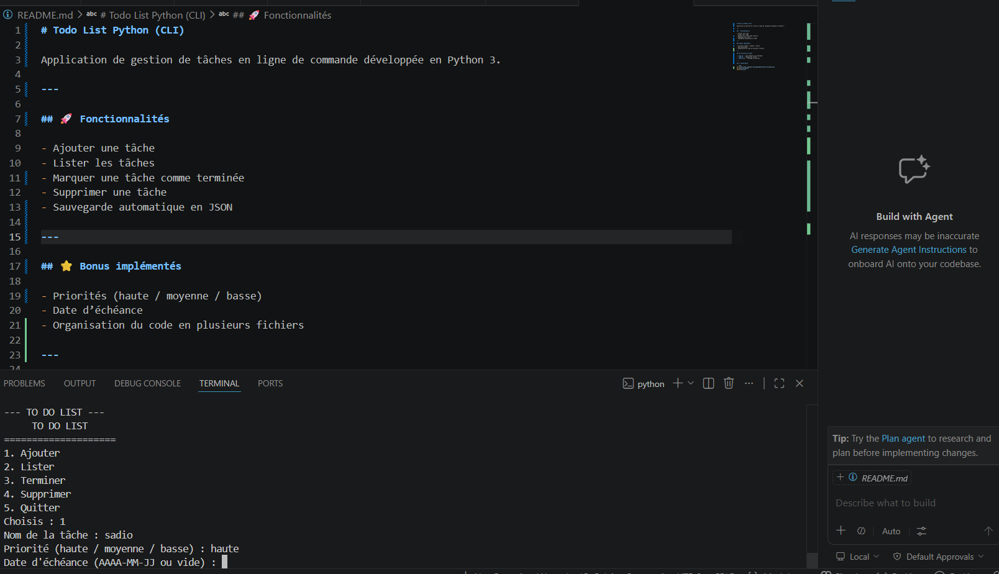
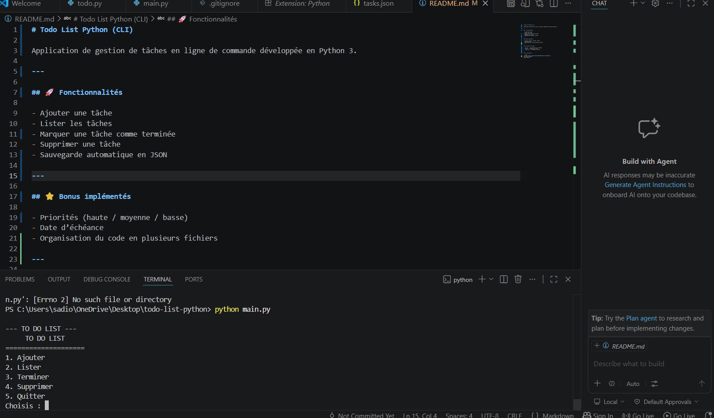

# Todo List Python (CLI)

Application de gestion de tâches en ligne de commande développée en Python 3.

---

## 🚀 Fonctionnalités

- Ajouter une tâche
- Lister les tâches
- Marquer une tâche comme terminée
- Supprimer une tâche
- Sauvegarde automatique en JSON

---

## ⭐ Bonus implémentés

- Priorités (haute / moyenne / basse)
- Date d’échéance
- Organisation du code en plusieurs fichiers

---

## 📁 Structure du projet

- `main.py` : point d’entrée du programme
- `todo.py` : logique des tâches
- `tasks.json` : stockage des données

---

## ⚙️ Installation

```bash
git clone https://github.com/sadioondoua/todo-list-python.git
cd todo-list-python
python main.py
## 📸 Aperçu du projet

## 📸 Aperçu du projet

### Menu principal


### Liste des tâches
